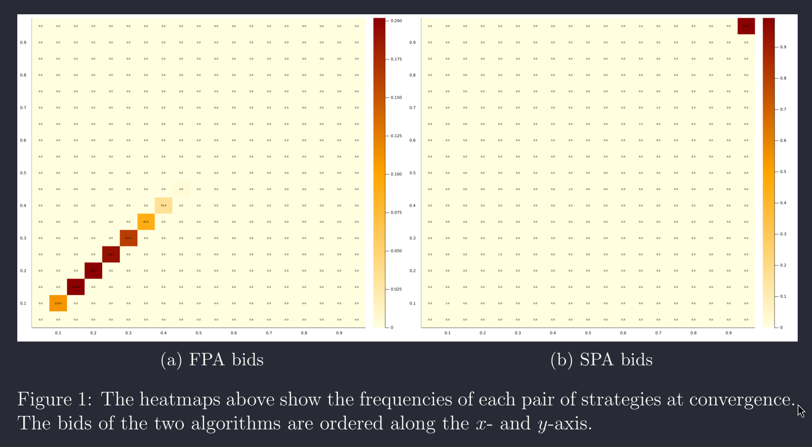

# Q-learning in Auctions 

## Basic RL

An agent interacts with an environment through a sequence of actions, observations and rewards. The agent's goal is to learn a policy that maximizes the expected sum of discounted rewards.

## Environment with more than one agent

Each agent continues to see the environment as usual, considering the other agents as part of the environment. From the perspective of one of the agents, the policies of each other agent is incorporated to the environment dynamics and can be controled through his actions. The difference here is that this policies aren't full observable, and the agent must have some infer it (through the other agents' actions, communication or other signals).

## Auction Setup

The auction framework is a simple game that can be challeging to learn. In its more simple formulation, one auctionner offers a single good, which he values at zero, and two learning bidders make bids to win the good. At each round, each bidder chooses a policy, from which an action will be drawn, an auction rule determines the winner (first-price, seconde-price) and each agent updates its policy through some learning algorithm. 

Although the actions of each bidder is influencing in the others' policies, the observations that each bidder has access to are not controllable (two of these observations, that are part of the state, is the number of bidders that participates in the round and the private value of each bidder, two pieces of information that even if the bidders had access to, they can't influence in their dynamics). 

Then, in its simplest formulation, the auction problem falls in the Bandit framework.

## Auctions with winning bid observation 

If in the auction rules we add that at the end of each round the winner's bid is revealed to all bidders, then we can use the RL framework, since know the bidder can inflence the other bidders' policies through the winning bid.

### RL Setup

- First-price auction
- State_i: round((winning_bid / bidder_i.private_value) * 10)
- Reward: 0 (loser) ; winner.private_value - winning_bid (winner)
- Action: $a \in [0,1]$ -> percentage of private value 
- Bid: $b = a * bidder_i.private_value$

- 2 bidders
- Private value constant and symmetric

#### Results

- Tit for tat: at each round the bidder observes the winning bid. If it is low he will bid low. If is high he will bid high. Since he can't see the others' bid, only the winning one, the bidding trajectory is ascending.

## Using DRL

Use a policy gradient algorithm with a Beta distribution as the bidders' policy. 

'Improving Stochastic Policy Gradients in Continous Control with DRL using Beta Distribution'

# Artificial Intelligence and Auction Design

The following sections are just a reproduction of key points of the paper 'Artificial Intelligence and Auction Design'. At the end there is Comment section, where I make some considerations.

## Introduction

Setup: bidding agents with value $v = 1$ over $1$k experiments, where each involve $1$mi auctions.

Results: 

- [ ] Agents observes only their own rewards.
	- (First-price) bidders converge over time to much lower bids - this seems to be reminiscent of tacit collusion.
	- (Second-price) bidders in the repeated second-price auctions converge to bidding according to the static Nash equilibrium prediction and the revenues to the auctioneer are high. 
- [ ] Agents observe the winning bid.
	- (First-price) bidders can update the Q vector not only for the current bid, but for  all counterfactual bids (so-called synchronous updating) -> Bidders converge to highly competitive bids.

## The Model

Two bidders participate in a sequence of auctions. In every period $t \in \left\{1, \dots,\infty\right\}$ an auctioneer runs an auction to allocate a single non-divisible object to one of the bidders. Both bidders value the object at $v _{i}=1$ and the value is constant over time.

We consider a family of auction formats parameterized by $\alpha \in [1,2]$. In an $\alpha$-auction the highest bidder wins and pays a convex combination of the winning and the losing bid. The weight on the losing bid is $\alpha -1$, and the weight on the winning bid is $2-\alpha$.

The payoff of the winner of period $t$ auction is $\pi_{t} = 1 - p_{t}$, where $p_{t}$ is the price determined by the mechanism chosen by the auctioneer. The losing bidder gets a payoff of $0$. Bidders maximize the expected sum of discounted per-period payoffs with a discount factor $\gamma \in (0,1)$.

## Q-Learning

In each period two agents choose a bid $b_{t}^{i} \in B = \left\{b_{1},\dots,b_{m} \right\}$. The agents earns a stochastic reward $r_{t}$ distributed according to $F (r_{t}|b_{t}^{i},b_{t}^{-i})$.

A convenient simplification is absence of states for the algorithm.

While some papers design the learners to keep track of past actions, in the original Q-learning formulation states are Markovian parameters of the environment. In this sense, our environment is time-independent, and the algorithms do not need any additional information about play.

Each agent maximizes the discounted sum of rewards $\mathbb{E} \left[\sum_{t}^{\infty}\gamma ^{t}r_{t}\right]$ where $\gamma < 1$ is the discount factor. Instead of considering the value of Dynamic Programming, Q-learning estimates the action-value function:
$$
\begin{equation}
	Q (a) = \mathbb{E}\left[r | b^{i}, b^{-i}\right] + \gamma \mathbb{E}\left[\max_{b^{\prime}} Q (b^{\prime})\right]
\end{equation}
$$

## Paper Comments

I want to stop at this point of the paper. In the bandit formulation, a reward maximizing agent interacts with a environment through an action, receiveing a reward, in each step, that is a function of this action. Through repetition, the agent trys to 'discover' the reward distribution (this can be done through a set of different algorithms), and then, when the agent is confident that she has found the optimal action (or optimal policy), she exploit it.

In the simplest formulation, the bandit problem doesn't have a state (or you could think of a problem with a single repeting state in each step, making it redundant). A more broad bandit problem incorporates states (also called context in the bandit literature), giving additional information to the agent of what is the reward distribution that she is interacting with. This formulation resembles the RL formulation, except that in the bandit model the states dynamics are independent of the agent's actions.

If you agree with this argument, you could say that the Q-learning algorithm proposed by the authors is in fact a bandit algorithm. Indeed, considering the first-price auction and the associated reward $r_{i} = (1 - b_{i})\mathbb{I}_{\left\{b_{i} > b_{-i}\right\}} +  y(1- b_{i})\mathbb{I}_{\left\{b_{i} = b_{-i}\right\}}$, where $y \sim$Ber$(0.5)$, then
$$
\begin{align*}
	Q_{i} (b_{i}) &= \mathbb{E}\left[r_{i}| b_{i}, b_{-i}\right] + \gamma \mathbb{E}\left[\max_{b^{\prime}} Q_{i} (b^{\prime})\right]\\
	&= \mathbb{E}\left[(1 - b_{i})\mathbb{I}_{\left\{b_{i} > b_{-i}\right\}} +  y(1- b_{i})\mathbb{I}_{\left\{b_{i} = b_{-i}\right\}} | b^{i}, b^{-i}\right] + \gamma \mathbb{E}\left[\max_{b^{\prime}} Q (b^{\prime})\right]\\
	&= (1 - b_{i})\mathbb{I}_{\left\{b_{i} > b_{-i}\right\}} + (1- b_{i})\mathbb{I}_{\left\{b_{i} = b_{-i}\right\}}\mathbb{E}\left[ y \right] + \gamma \mathbb{E}\left[\max_{b^{\prime}} Q (b^{\prime})\right]\\
	&= (1 - b_{i})\left[\mathbb{I}_{\left\{b_{i} > b_{-i}\right\}} + \frac{\mathbb{I}_{\left\{b_{i} = b_{-i}\right\}}}{2}\right] + \gamma \mathbb{E}\left[\max_{b^{\prime}} Q (b^{\prime})\right]\\
\end{align*}
$$

But I woundn't go too far to state that the problem is a bandit one, I still think it is a RL problem. But unlike the authors, I think that the problem is mis-specified. First, the expectation in (1) is with respect to something. It could

