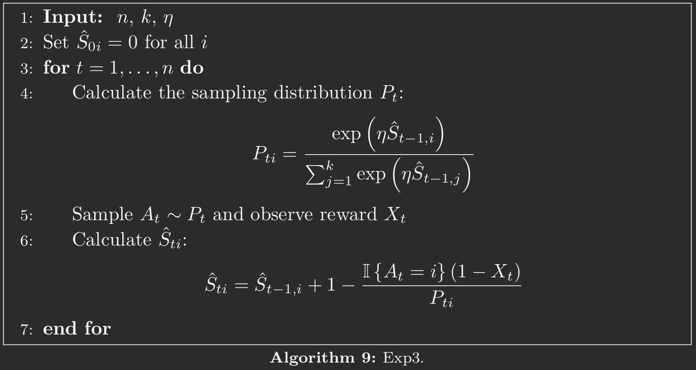
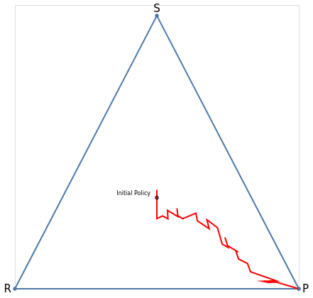
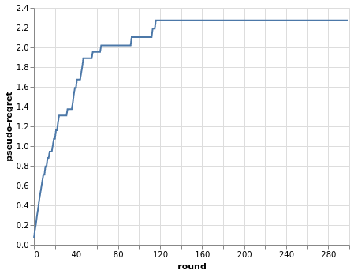
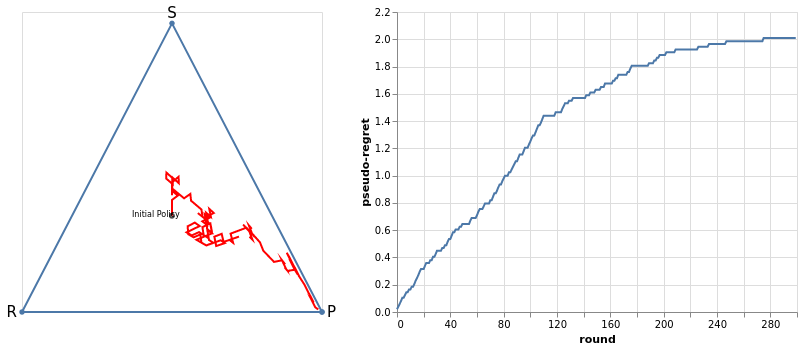
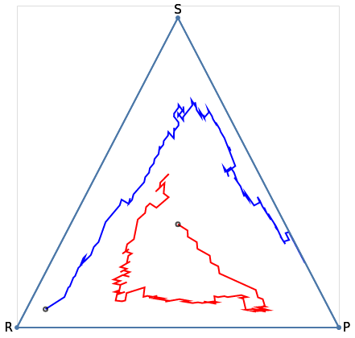

# Rock-Paper-Scissors
### Learning to play through bandit algorithms

#### Initial Setup
Rock-Paper-Scissors (RPS) is a fairly simple game that can be used as an environment to implement some learning algorithms. In this game two players simultaneously choose one of three options: rock, paper, or scissors. The winner is determined by the following rules:

	- Rock beats scissors
	- Scissors beats paper
	- Paper beats rock

We can model this game in the bandit framework. A bandit problem can be defined as follows:

**Definition 1 (Bandit Problem)** A bandit problem is a tuple $(\mathcal{A} ,\mathcal{C}, \mathcal{R})$, where $\mathcal{A}$ is the set of arms (or actions), $\mathcal{C}$ is the set of contexts and $\mathcal{R}: \mathcal{A} \times \mathcal{C} \to \Delta(\mathbb{R})$ is the reward function, where $\Delta(\mathbb{R})$ is the space of probability distributions over $\mathbb{R}$. 

This is a sequential decision problem where a learner interacts with an environment over $n$ rounds, $n \in \mathbb{N}$. In each round $t \in [n]$ the learner receives a context $c_{t} \in \mathcal{C}$, that can be seen as the state of the environment, chooses an action $a_{t} \in \mathcal{A}$ and the environment then reveals a reward $x_{t} \sim \mathcal{R}(a_{t}, c_{t})$.  

The context space can be unitary, resulting in the irrelevance of the context for the agent's decision making. Thus we can define $\mathcal{R}(a,c) = \mathcal{R}(a)$, for $c \in \mathcal{C}$ and every $a \in \mathcal{A}$, incorporating the only context to the law of the rewards. This happens in the classic slot machine example, where the learner has $K$ arms to chose from, and the context doesn't matter. On the other hand, for example, if we would play the same $K$ slot machines, but in different geographical regions, then we would have different context that could affect the reward (the new owner could modify the reward mechanism, for example).

Another remark about the context is that $\mathbb{P}(c_{t+1}|c_{t},a_{t}) = \mathbb{P}(c_{t+1}|c_{t})$, for every $t \in [n]$. This means that the learner has no influence over the context dynamics. This contrasts with the Reinforcement Learning (RL) framework, where the learner can influence the state dynamics through her actions. 

The reward associated with the action chosen are always revealed and the rewards associated with the other actions not chosen may or may not be revealed to the learner. The later, when revealed, is an important information to the learner, since she can make a better update of the estimated reward distribution for each arm, even if she never play most of them.

The way the reward function behaves determines the type of bandit problem that the learner is facing. If the reward function remains the same regardless of the learner's actions, then the learner is facing a stochastic bandit problem. On the other hand, if the reward function adapts to the learner's actions, then the learner is facing a adversarial bandit problem. Other way to see an adversarial bandit is that at each round the adversary chooses the reward to each action. One example for the former are $K$ slot machines and one for the later is the RPS game.

Returning to the RPS game, we set the tuple $(\mathcal{A}, \mathcal{C}, \mathcal{R})$ as follows: $\mathcal{A} = \{R,P,S\}$, $\mathcal{C} = \{I_{1}, I_{2}, \dots\}$, the set of different adversaries, and the reward functions is defined as follows:
$$
\begin{align*}
\mathcal{R}_{t}(R,I_{j}) = [\pi_{R,t}^{j}(0),\pi_{P,t}^{j}(-1),\pi_{S,t}^{t}(1)]\\
\mathcal{R}_{t}(P,I_{j}) = [\pi_{R,t}^{j}(1),\pi_{P,t}^{j}(0),\pi_{S,t}^{j}(-1)]\\
\mathcal{R}_{t}(S,I_{j}) = [\pi_{R,t}^{j}(-1),\pi_{P,t}^{j}(1),\pi_{S,t}^{j}(0)]
\end{align*}
$$
where $\pi_{A,t}^{j}$ is the adversary j's probability of playing action $A$ (adversary policy) at time $t$ and the number in parentesis is the outcome if this action is choosen. This is a Game Theory notation for a lottery. In this case, each time the learner choses an action, she is actually choosing a lottery over the outcomes $\{-1,0,1 \}$

#### Learner's Objective and Policy

The objective of the learner is to maximize her total reward $S_{n} = \sum_{t=1}^{n}X_{t}$.

Given the bandit problem, the learner needs a strategy to make the best decisions, with the aim to maximize her total reward. Since the learner is constrained by a finite number of interactions with the environment, she has to balance exploration with exploitation. Exploration is needed to gather data over actions, with the objective of finding the best action (or set of best actions), while exploitation is required to extract the maximum amount of reward from the environment, by choosing the best (inferred) action.

The strategy is set by a policy "function $\pi : ([k]\times [0,1])^{*} \to \mathcal{P_{k-1}}$, mapping history sequences to distributions over actions (regardless of measurability)." (Lattimore & Szepesvari)

We can evaluate the learner's policy by using the regret, that can be defined in different ways. In the stochastic setting the learner's policy is evaluated relative to the best policy $\pi^{*}$, whereas in the adversarial case we compare the learner's actions with the best actions in hindsight.
$$
\begin{align*}
	R_{n}(\pi) = n \max_{i \in [k]} \mu_{i} - \mathbb{E}_{\pi}\left[ \sum_{t=1}^{n}x_{A_{t},t} \right] \qquad \text{(Stochastic Regret)}
\end{align*}
$$
$$
\begin{align*}
	R_{n}(\pi) = \max_{i \in [k]}\sum_{t=1}^{n}x_{i,t} - \mathbb{E}_{\pi}\left[ \sum_{t=1}^{n}x_{A_{t},t} \right] \qquad \text{(Adversarial Regret)} 
\end{align*}
$$

### Exp3 Algorithm

The Exp3 (Exponential-weight algorithm for exploration and exploitation) is an adversarial Bandit Algorithm. Consider a policy $\pi$ such that, for action $i$ at time $t$,
$$ \pi_{i,t} = \mathbb{P}(A_t = i | A_1,X_1,\dots,A_{t-1},X_{t-1})$$
where $\pi_{i,t}>0$, for all $i$ and $t$, and $X_{t}$ is the reward at time $t$. Consider that the learner only observes the reward of the action sampled from her policy. The importance-weighted estimator of $x_{i,t}$, the true reward of action $i$ at time $t$, is
$$
\begin{equation}
\hat{X}_{i,t} = \frac{\mathbb{I}_{\{A_{t} = i\}} X_{t}}{\pi_{i,t}},
\end{equation}
$$
This is an unbiased estimate of $x_{i,t}$ conditioned on the history observed after $t-1$ rounds. Indeed,
$$
\begin{align*}
	\mathbb{E}\left[\hat{X}_{i,t}|A_1,X_1,\dots,A_{t-1},X_{t-1}\right] &= \mathbb{E}_{t}\left[\hat{X}_{i,t}\right] \\
	&= \mathbb{E}_{t}\left[\frac{\mathbb{I}_{\{A_{t} = i\}} X_{t}}{\pi_{i,t}}\right]\\
	&= \mathbb{E}_{t}\left[\mathbb{I}_{\{A_{t} = i\}}\right] \frac{\mathbb{E}[X_{t}]}{\pi_{i,t}}\\
	&= x_{i,t}
\end{align*}
$$
Despite being a unbiased estimator, it may be a high variance estimator. Its variance is $\mathbb{V}[\hat{X}_{i,t}]= \frac{x^{2}_{i,t}(1-\pi_{i,t})}{\pi_{i,t}}$, that can be extremely large when $\pi_{i,t}$ is small and $x_{i,t}$ is bounded away from zero [Lattimore & Szepesvari]. An alternative unbiased estimator is
$$
\begin{equation}
	\hat{X}_{i,t} = 1 - \frac{\mathbb{I}_{\left\{A_{t}=i \right\}}}{\pi_{i,t}}(1- X_{t})
\end{equation}
$$
 
Now consider $\hat{S}_{i,t} = \sum_{s=1}^{t}\hat{X}_{i,t}$, the total estimated reward for action $i$ by the end of round $t$. We can use this estimate to update the policy $\pi_{i,t}$, by using the following update rule:
$$
\begin{equation*}
	\pi_{i,t} = \frac{ \exp\left(\eta\hat{S}_{i,t-1}\right)}{\sum_{j=1}^{k}\exp\left(\eta\hat{S}_{j,t-1}\right)}
\end{equation*}
$$
where $\eta$ is the exploitation rate: when is high, it favors exploitation, while when is low it favors exploration. This hyperparameter can be fixed or vary through time, thus depending on the number of arms and/or the horizon. The EXP3 algorithm is summarized in the following figure, using the alternative estimator for $r_{i,t}$.

### Simulation
#### Stochastic Setting

Using the Exp3 Algorithm, we simulate a RPS game with one adversary that has a fixed policy. The game is played over $300$ rounds, the adversary's policy is $\pi^{0} = [\pi_{\tiny R}^{0}, \pi_{\tiny P}^{0}, \pi_{\tiny S}^{0}] = [0.55 ,0.40 , 0.05]$ and the learner's exploitation rate is $0.4$. The rewards are multiplied by $0.1$ to scale them down. The following figure shows the path for the learner's policy through the $300$ rounds.

$\qquad \qquad \qquad \qquad$ 

To use the regret to measure how well this policy performs, we define the following regret functions:
$$
\begin{equation*}
	\hat{R}_{n} = n \mu^{*} - \sum_{t=1}^{n} X_{t} \qquad \text{(random regret)}
\end{equation*}
$$
$$
\begin{equation*}
	\bar{R}_{n} = n \mu^{*} -  \sum_{t=1}^{n} \mu_{A_{t}} \qquad \text{(pseudo-regret)}
\end{equation*}
$$
where $\mu^{*}$ is the mean reward of the best action. We will use the pseudo-regret to measure the performance of the Exp3 algorithm. For our example we have $\mu = [\mu_{R}, \mu_{P}, \mu_{S}] = [-0.035, 0.05, -0.015] \implies \mu^{*}= 0.05$.

$\qquad \qquad \qquad \qquad$ 

We can see that the regret is decreasing until it stabilizes below $2.4$. 

We can see another example where the adversary fixed policy is more balanced, like $\pi^{0} = [0.35 ,0.40 , 0.25]$. In this case, the mean for each action is: $\mu_{R} = -0.01$, $\mu_{P} = 0.015$, $\mu_{S} = -0.005 \implies \mu^{*} = \mu_{P}$. Different from the previous example, playing paper as the optimal action is not obvious, observation that reveals itself when we simulate the game, where the learner takes time to find the optimal policy. The figure below shows the performance of a lerner in this environment, through $300$ rounds with a exploitation rate of $0.4$.

$\qquad \qquad \qquad \qquad$ 

#### Adversarial Setting 

In the adversarial setting we have a real game, where the adversary responds to the learner's actions, adapting its own policy following some objective, like maximizing its own total rewards. In the figure below the learner plays with an adversary that uses the Exp3 algorithm to update its policy, in the same way as the learner. 

$\qquad \qquad \qquad \qquad$ 

We can see that the adversary starts with a high probability of playing Rock, and the leaner responds by increasing its probability of playing Paper, followed by the adversary increasing its probability of playing Scissors, and so on. Because of the high variance of the Exp3 algorithm, the trajectories of the policies are not smooth and an equilibrium is highly unlikely, but the overall trend is clear.

#### Conclusion

In conclusion, bandit algorithms such as the Exp3 algorithm are useful tools for solving problems where we must make decisions under uncertainty. By balancing the exploration and exploitation of different options, these algorithms can learn which actions yield the highest rewards. As demonstrated in the rock, paper, scissors game, the Exp3 algorithm is able to learn and adapt to its opponent's behavior, allowing it to achieve a decent performance. Overall, bandit algorithms offer a good approach for optimizing decision-making in a some applications.

#### Resources

In calculating the exponentials of the Exp3 algorithm, I got some numerical instability. To stabilize it, I used the approach presente [here](https://gregorygundersen.com/blog/2020/02/09/log-sum-exp/). In, addition, the book Bandit Algorithms was used as reference, from where I got the algorithm framework and some of the definitions.
