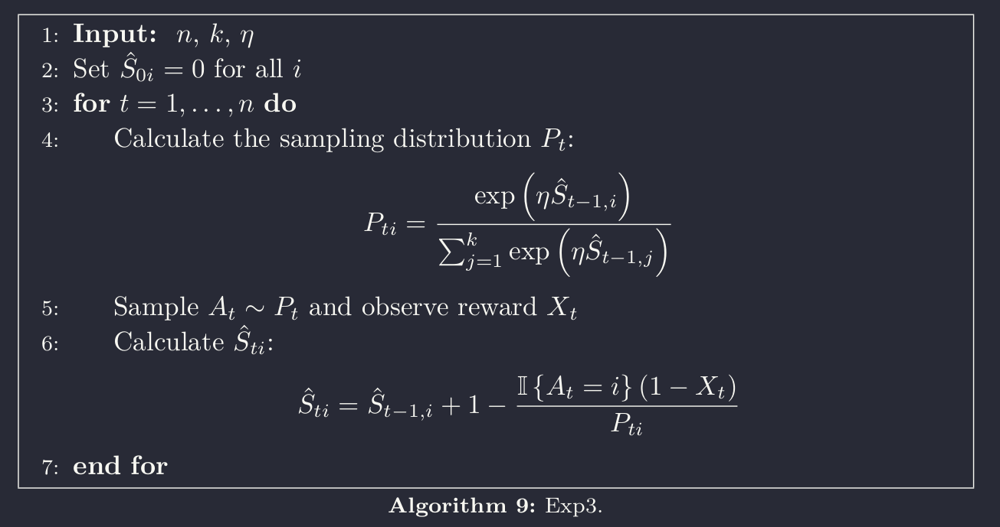

# The Rock, Paper and Scissors Game

## Best Responses

Before we get into the learning algorithms, let's first look at the best response that a player can have to an adversarial environment (the other player). Let $\pi = [\pi_{R},\pi_{P},\pi_{S}]$ be the agent strategy and let $T = [T_{R},T_{P},T_{S}]$ be the environment fixed strategy. For every $t \in [0, \infty)$, the rewards are set such that $r_{t} \in \{1,-1,0 \}$, respectively for winning, losing and drawing. Defining $\mathcal{R} = \sum_{t = 0}^{\infty} r_{t}$, the expected return for a particular policy $\pi$ is:
$$
\begin{aligned}
\mathbb{E}_{\pi,T}[\mathcal{R}] = &\pi_{R}T_{R}(0) + \pi_{P}T_{P} (0)+ \pi_{S}T_{S} (0)\\
&+ \pi_{R}T_{P}(-1) + \pi_{R}T_{S}(1)\\
&+ \pi_{P}T_{S}(-1) + \pi_{P}T_{R}(1)\\
&+ \pi_{S}T_{R}(-1) + \pi_{S}T_{P}(1)\\
&=\pi_{R}(T_{S}-T_{P}) + \pi_{P}(T_{R}-T_{S}) + \pi_{S}(T_{P}-T_{R})\\
\end{aligned}
$$

Note that if $T=[\frac{1}{3},\frac{1}{3},\frac{1}{3}]$, then the expected reward of this game to the player is zero. Otherwise, if the environment give different probabilities for each action than the uniform, then the best response of the player is to concentrate her strategy in one action.
Indeed, for example, if $T_{S}>\frac{1}{2}$, then $(T_{S}-T_{P})>0$, $(T_{R}-T_{S})<0$ and $T_{S} > (T_{P}-T_{R}) \implies [1,0,0] = \argmax_{\pi \in \Pi} \mathbb{E}_{\pi,T}[R]$.

## Reinforcement Learning Setup

First we will define the game of Rock, Paper and Scissors - RPS.

> **Definition 1** The game of RPS is a tuple $(N, A, S, R)$, where $N = \{1,2\}$ is the set of players, $A = \{R,P,S\}$ is the set of actions, $\mathbb{S}_{i} \subseteq [0,1]^{3}$ is the space of strategies for the player $i$, with $\pi^{i} \in [0,1]^3$ for each $i \in N$, and $R$ is the reward function.

This is a zero-sum game that is played in one round, over $T$ times, where $T \in [0, +\infty)$. At each time $t \in [0, T]$, each player $i \in N$ draws, simultaneously, an action $a_{i,t} \sim \pi^{i,t}$. After each player reveals her action, each receives a reward following the function $R^{i}:(A^1,A^2) \longrightarrow \{-1, 0, 1\}$. Note that at each $t$, the players may have different strategies. The players' strategies are the elements that define jointly the state of the game.

The strategy $\pi^{2,t}$, from the perspective of player 1, is a non-observable state of the environment and is only partially observable through the actions executed by player 2.

## Bandit Setup
### Exp3 Algorithm

The Exp3 (Exponential-weight algorithm for exploration and exploitation) is a Bandit Algorithm, meaning that it is not a sequential decision algorithm in the same way as a Reinforcement Learning one. In this setting the environment have a state space that is independent of the player actions. That is, given that the player is in state $s_{t}$ and executes action $a_{t}$, $\mathbb{P}(s_{t+1}|s_{t},a_{t}) = \mathbb{P}(s_{t+1}|s_{t})$, for all $t$. However, taking this away, in the same way as in RL, the agent tries to learn a strategy that maximizes a sequence of rewards.

The following content is based on the book Bandit Algorithms.

Consider a policy $\pi$ such that, for action $i$ at time $t$,
$$ \pi_{i,t} = \mathbb{P}(A_t = i | A_1,R_1,\dots,A_{t-1},R_{t-1})$$
where $\pi_{i,t}>0$, for all $i$ and $t$. The importance-weighted estimator of $r_{i,t}$, the mean reward of action $i$ at time $t$, is
$$\hat{X} = \frac{\mathbb{I}\{A_{t} = i\} R_{t}}{\pi_{i,t}}$$
This is an unbiased estimate of $x_{i,t}$ conditioned on the history observed after $t-1$ rounds.

#### The Algorithm

Let $\hat{S}_{i,t}= \sum_{s=1}^{t} \hat{X}_{i,s}$ be the to total estimated reward by the end of round $t$. Fixing the parameter $\eta>0$, the learning rate, we define the exponential weighting as 
$$\pi_{i,t} = \frac{\exp(\eta \hat{S}_{i,t-1})}{\sum_{j=1}^{k}\exp{(\eta \hat{S}_{j,t-1})}}$$

